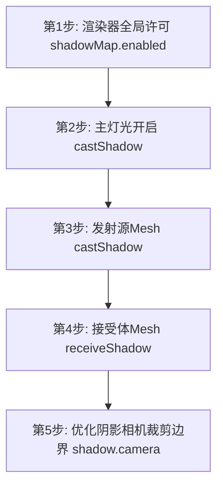

# 第3章：光影变幻、高能阴影渲染与自适应时间帧循环（Three.js 篇）

没有光影，一切 3D 渲染都只是苍白无力的彩色折线。
在高级图形开发中，**阴影计算（Shadow Map）** 天然是耗费 GPU 计算最庞大、同时也是最显视觉质量的骨干模块。

本章我们将：
1. 精解 Three.js 中的 4 种主核光源性能和特征。
2. 逐一演示在 Web 渲染中**如何分步开启阴影（避免由于漏设参数而在阴影排错中感到迷茫）**。
3. 学习如何对标 C# GameLoop 计算 **Delta Time（时间增量）**，从而写出支持在 60Hz 办公屏与 144Hz 显竞屏上拥有绝对一致运动速度的渲染主循环。

---

## 1. 4 种主核光源类型与性能天梯

在场景中投下一盏灯，光线投射在物体的法向表面进行折射计算。

```
                       [ Light Source ]
                            / | \
                           /  |  \
                          /   |   \
                         v    v    v
                       [ 3D Object Surface ]
```

我们需要在效果和显卡计算成本之间取得平衡：

1. **`AmbientLight` (环境光)**
   - **特点**：全无差别、均匀照亮全场所有物体的每一个像素。**没有方向，没有起点，更无法产生阴影**。
   - **性能开销**：极低（近乎 0）。它是单纯的一句材质色彩加法算法。
2. **`DirectionalLight` (平行光 / 直射光)**
   - **特点**：**对标大自然中的“太阳光”**。光线之间绝对平行，常用来模拟日光或大型室外主照明光源。**能产生高质量阴影**。
   - **性能开销**：中等。
3. **`PointLight` (点光源)**
   - **特点**：**具有空间物理起点的“蜡烛”/“灯泡”**。光芒向四面八方 360 度漫射，并且可以设置随着距离增加而物理衰减（Decay）。**能产生全立体多向阴影**。
   - **性能开销**：高。向 6 个方向投影运算。
4. **`SpotLight` (聚光灯)**
   - **特点**：一个手提**“手电筒”/“探照灯”**。具备椎体发散角度（`angle`）、边缘羽化过渡（`penumbra`）。**非常适合营造精细的工业聚焦光和局部阴影**。
   - **性能开销**：中高。

---

## 2. 核心教学：5 步完美配置“物理阴影（Shadow Map）” 

许多 .NET 新手写代码时，即便把灯光的 `.castShadow` 设为 `true`，场景里铺了地表，却怎么也看不到阴影。
**这是图形学中的经典设计机制：阴影计算对显存和像素着色器耗能过大，因此在所有主流 3D 渲染引擎中，阴影默认都是彻底关闭的！**

你必须紧随以下 **“五步金字塔原则”** 分步激活，影子魔法才在页面中真正呈现：



### 实战：配制完美的带阴影渲染场景

```typescript
import * as THREE from 'three';

// ----------------------------------------------------
// 【第1步】：通知渲染器全局开启阴影贴图支持
// ----------------------------------------------------
const renderer = new THREE.WebGLRenderer({ antialias: true });
renderer.shadowMap.enabled = true; // 唤醒影子总闸
renderer.shadowMap.type = THREE.PCFSoftShadowMap; // 开启高级百分比渐进柔和阴影，消除影子边缘的锯齿

const scene = new THREE.Scene();

// ----------------------------------------------------
// 【第2步】：必须选择一盏支持阴影的光源（如 DirectionalLight 或 SpotLight）
// ----------------------------------------------------
const sunLight = new THREE.DirectionalLight(0xffffff, 1.2);
sunLight.position.set(5, 8, 5); // 确保悬吊在半高空
sunLight.castShadow = true;     // 通知此光源：你现在具备影子投射本领！

// 辅助影子贴图的分辨率优化（像素比默认512*512往往粗糙。设为2048让投影边缘刀锋般细腻）
sunLight.shadow.mapSize.width = 2048;
sunLight.shadow.mapSize.height = 2048;

scene.add(sunLight);

// ----------------------------------------------------
// 【第3步】：创建会挡住光线并生成影子的“发射体网格” (Sender)
// ----------------------------------------------------
const sphereGeom = new THREE.SphereGeometry(1, 32, 32);
const sphereMat = new THREE.MeshStandardMaterial({ color: 0xff0055, roughness: 0.2 });
const sphere = new THREE.Mesh(sphereGeom, sphereMat);
sphere.position.y = 1.5; // 稍稍悬空，这样阴影投在地上格外好看

sphere.castShadow = true; // 【发射源】：我将遮挡阳光！
scene.add(sphere);

// ----------------------------------------------------
// 【第4步】：创建能承载影子的物理地面“接受体网格” (Receiver)
// ----------------------------------------------------
const floorGeom = new THREE.PlaneGeometry(10, 10);
const floorMat = new THREE.MeshStandardMaterial({ color: 0x444444, roughness: 0.8 });
const floor = new THREE.Mesh(floorGeom, floorMat);

// 将地面顺平躺在 XZ 物理平面（默认 PlaneGeom 是垂直耸立的）
floor.rotation.x = -Math.PI / 2; 

floor.receiveShadow = true; // 【接受体】：影子可以安心地洒在我的背上！
scene.add(floor);
```

---

## 3. 对齐 C# 核心：使用 Clock 渲染无级平顺的动画循环

在 C# 游戏开发（如 Unity 或 MonoGame）中，如果你想让一个物体以每秒固定 90 度的速度自转，在 `Update()` 中你绝对不会写出这种代码：
```csharp
// 灾难级代码：当硬件刷新率为 144Hz 时，每秒运行这行 144 次；而 60Hz 屏只会运行 60 次！
// 导致在电竞高刷屏上物体旋转速度极快，办公屏上却极其缓慢！
cube.Rotation += 1.0f; 
```

你会怎么写？对，引入 **Delta Time (帧时间差)**：
```csharp
// 正确写法：利用本次刷新与上一次刷新的物理微妙级差值 (dt) 进行运动差值计算
cube.Rotation += 90.0f * (float)gameTime.ElapsedGameTime.TotalSeconds;
```

在 Three.js 中实现这个机制极其简单，使用内置的 **`THREE.Clock`**。

### 实战：计算全局平顺时间帧循环

```typescript
// 1. 初始化 Three.js 物理时钟（开始时间标记）
const clock = new THREE.Clock();

// 定义一个我们期望的每秒旋转角弧度 (大约每秒转满 180度, 即 Math.PI)
const rotationSpeedPerSecond = Math.PI;

function animateLoop() {
  requestAnimationFrame(animateLoop);

  // 2. 核心大招：获取距离上一次刷新流逝的物理精确秒数 (.getDelta())
  const deltaTime = clock.getDelta(); // 对标 C# 中的 DeltaTime

  // (备选手段)：获取自页面打开至现在的累计流逝总秒数 (对齐 C# 中的 TotalGameTime)
  const elapsedTime = clock.getElapsedTime(); 

  // 3. 【无级流顺自转】：无论屏幕当前的刷新率是 30fps 还是 240fps，
  // 立方体在现实物理世界中的时间维度自转绝对保持完美的每秒一圈（无死角平滑）！
  sphere.rotation.y += rotationSpeedPerSecond * deltaTime;

  // 4. 利用正弦波 Math.sin 配合 elapsedTime 还能实现完美的物理弹性浮动（模拟浮动气泡）
  sphere.position.y = 1.5 + Math.sin(elapsedTime * 2) * 0.5;

  renderer.render(scene, camera);
}

// 启动时间系统并激活循环！
clock.start();
animateLoop();
```

---

现在，完美的几何模型、逼近现实反光的 PBR 材质、真实投下的柔和光影，以及对标 C# 的高精无级动画主循环已完全打通！点击 **[threejs/ch4_interactive_deploy.md](threejs/ch4_interactive_deploy.md)**，我们将了解最后的技术天险 —— 如何用鼠标指套点击选中 3D 里面的某一个物体（场景交互）、如何导入外部精丽的模型文件（glTF/glb 载入）并完成一键秒级 Web 部署发布！
